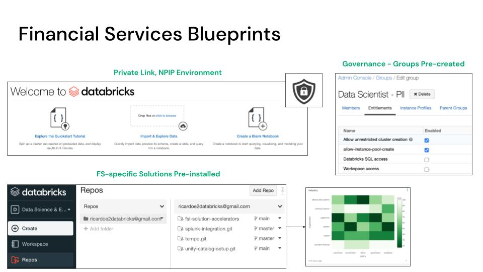

## Deploy Your Financial Services Lakehouse Architecture 

### Purpose: 

This set of terraform templates is designed to get every FS practitioner and devops team started quickly with financial services best practice setup as well as highly valuable FS-focused libraries directly in your environment. 

  

=======
### Architecture: 

### Details on What is Packaged: 

What's include in this Terraform package? 

1. Hardened Cloud Environment (restricted root bucket) for AWS
2. Basic Example of Permissions using Databricks ACLs and Groups for AWS
3. Pre-installed Libraries for Creating Common Data Models & Time Series Analytics (AWS | Azure | GCP)
4. Example Job with Financial Services Quickstarts (AWS | Azure | GCP)
5. PrivateLink Automation for AWS
6. Customer-Managed VPC with GCP
7. NPIP Architecture & Workspace Creation with Azure

### AWS 

3 main modules: 

* Workspace from scratch (new)
* Managed VPC - Private Link workspace
* Managed VPC - Pre-installed FS libraries, Groups to protect PII, Private Link

### Azure 

* Workspace from scratch (new)
* Managed VNET - No public IPs in VNET with private NSGs

### GCP 

* Bring-your-own-VPC configuration with GCP
