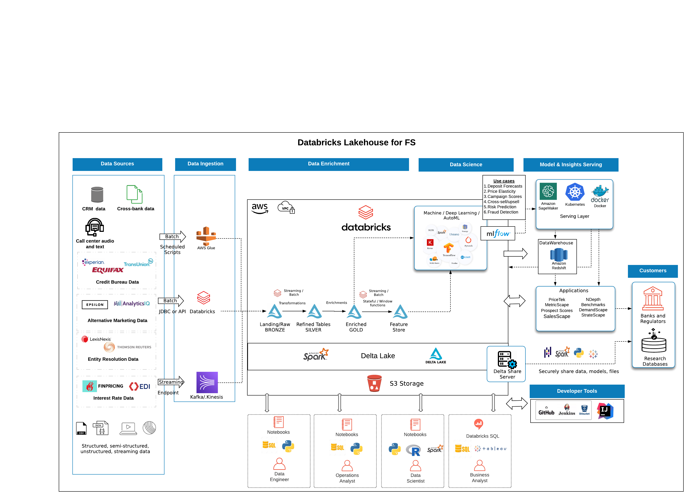

## Deploy Your Financial Services Lakehouse Architecture 

### Purpose: 

This set of terraform templates is designed to get every FS practitioner and devops team started quickly with financial services best practice setup as well as highly valuable FS-focused libraries directly in your environment. 

### Architecture: 

  

### Details on What is Packaged: 

What's include in this Terraform package? 

1. Hardened Cloud Environment (restricted root bucket) 
2. Restricted PII Rules via Databricks ACLs and Groups
3. Solutions Accelerators Pre-installed into Databricks Repos 
4. Sample Job Writing PII Data out to External Cloud Storage (Best Practice)
5. PrivateLink Automation for AWS

### AWS 

3 main modules: 

* Workspace from scratch (new)
* Managed VPC - Private Link workspace
* Managed VPC - Pre-installed FS libraries, Groups to protect PII, Private Link

### Azure 

* Workspace from scratch (new)
* Managed VNET - No public IPs in VNET with private NSGs